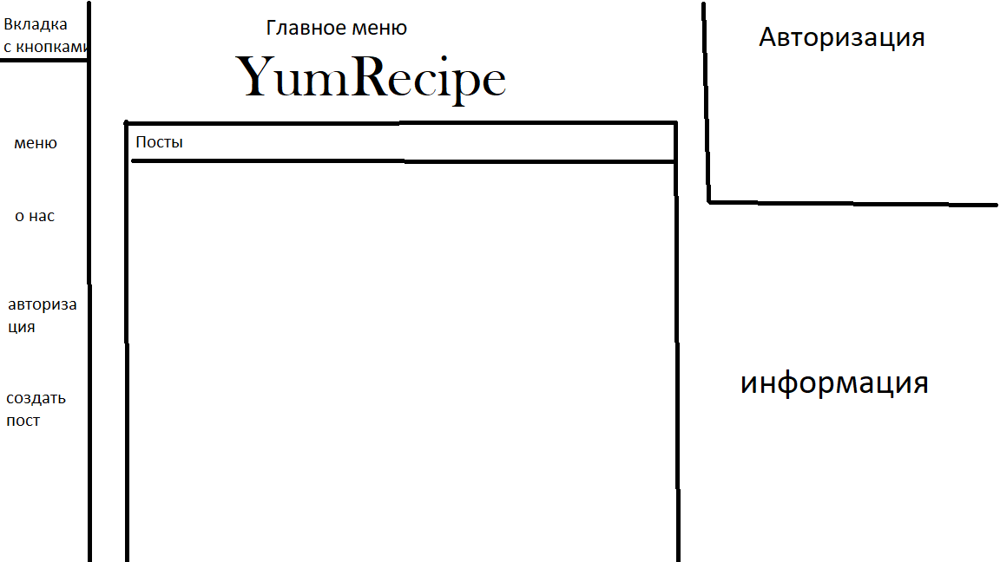
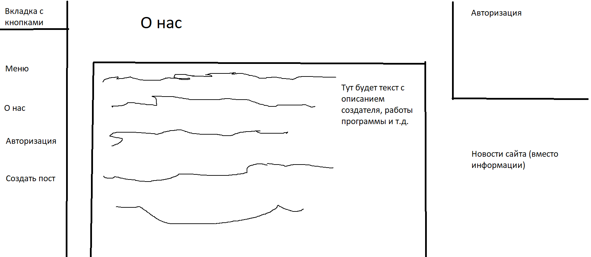
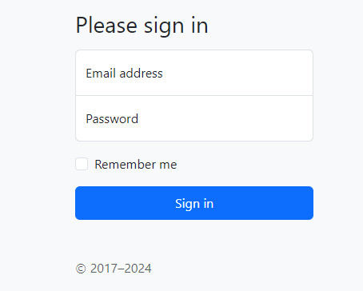
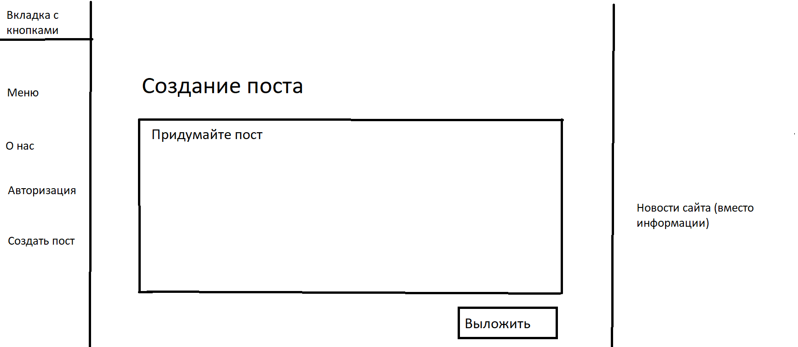

### 1. Project name
**YumRecipe**

### 2. Authors
- **Team Lead and Project Developer**: Резвушкин Николай Николаевич
- **Teacher**: Анатольев Алексей Владимирович

### 3. Description of the program
**I. Для чего нужен этот проект? Как он будет запускаться?**

Этот проект поможет поварам или любителям готовить разнообразить свой вкус, а так же научиться готовить новые интересные блюда. При входе на сайт пользователя будет встречать главная страница сайта с недавними постами, слева можно будет выбрать другие страницы этого сайта а справа можно будет зарегистрироваться/авторизоваться, чтобы пользователь мог выкладывать свои посты или ставить им оценки.

**II. Какие и сколько страниц понадобиться для сайта?**

Для данного сайта планируется создать около 4-5 страниц. 1 - страница регистрации, 2 - страница главного меню, 3 - страница для написания поста, последние будут нужны для действий с сайтом.

**III. Какие элементы страниц будут использованы на сайте?**

Для работоспособности сайта будут использоваться элементы из bootstrap, например: Sign-in - он поможет мне с созданием страницы регистрации/входа аккаунта; Sidebard поможет мне с созданием переходов на другие страницы.

**IV. Какие персональные данные могут понадобиться для регистрации и авторизации на сайте?**

Для регистрации и авторизации на сайте могут понадобиться никнейм (логин, который нельзя использовать повторно) и пароль. Этих данных будет достаточно для оставления постов.

**V. Какие файлы, загружаемые пользователем сайта, могут понадобиться в работе сайта?**

Возможно для сайта от пользователя могут понадобиться картинка для создания своей аватарки

**VI. Какую информацию нужно будет сохранять в процессе работы сайта в виде файлов? Какая
информация будет храниться в базе данных сайта?**

В базе данных будут храниться данные о пользователе, а так же посты, выпущенные пользователем и их рейтинг.

### 4. Code plan
**Переменные и константы**

- `app` - создание экземпляра flask

- `params` - данные

В доработке

**Функции**

- `main` - главная страницу сайта

- `account` - страница регистрации/авторизации аккаунта

- `post` - страница создания поста

В доработке

**Классы**

В доработке

**Библиотеки**

- `flask` - создание сайта
- `flask-wtf` - дизайн и помощь в создании сайта
- `sqlalchemy` - помощь с базой данных

В доработке

### 5. Site interface

- **Страница главного меню:**



- **Страница 'О нас'**



- **Страница авторизации**



- **Страница создания поста**


**(Данные страницы могут быть изменены в будущем)**

### 6. Deadlines
```md
| Task                           | Estimated Time  |
|--------------------------------|-----------------|
| Начало работы над сайтом, меню | 1 week          |
| Работа над сайтом, о нас       | 5 days          |
| Создание страницы регистрации  | 4 days          |
| Создание страницы выложить пост| 4 days          |
| Работа с базой данных, баг тест| 1-2 weeks       |
| Total Time                     | ~ 4-5 weeks     |
```
