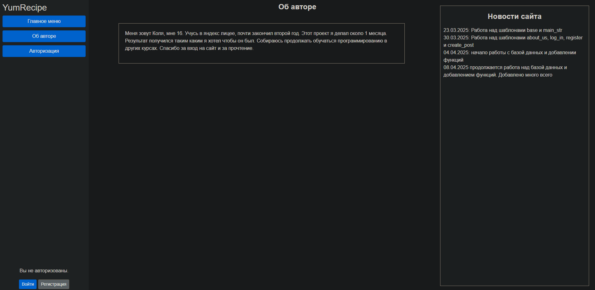

### 1. Project name
**YumRecipe**

### 2. Authors
- **Team Lead and Project Developer**: Резвушкин Николай Николаевич
- **Teacher**: Анатольев Алексей Владимирович

### 3. Description of the program
**I. Для чего нужен этот проект? Как он будет запускаться?**

Этот проект поможет поварам или любителям готовить разнообразить свой вкус, а так же научиться готовить новые интересные блюда. При входе на сайт пользователя будет встречать главная страница сайта с недавними постами, слева можно будет выбрать другие страницы этого сайта или зарегистрироваться/авторизоваться, чтобы выкладывать свои посты. Запускаться он будет через главный файл main.py

**II. Какие и сколько страниц понадобиться для сайта?**

Для данного сайта планируется создать около 7 страниц. 1 - страница регистрации, 2 - страница главного меню, 3 - страница для написания поста, 4 - авторизация, 5 - базовый шаблон, 6 - об авторе, 7 - детали поста

**III. Какие элементы страниц будут использованы на сайте?**

Для работоспособности сайта будут использоваться элементы из bootstrap, например: Sign-in - он поможет мне с созданием страницы регистрации/входа аккаунта; Так же будут использоваться кнопки, ввод текста, контейнеры и пару других.

**IV. Какие персональные данные могут понадобиться для регистрации и авторизации на сайте?**

Для регистрации и авторизации на сайте могут понадобиться никнейм, почта и пароль. Этих данных будет достаточно для оставления постов.

**V. Какие файлы, загружаемые пользователем сайта, могут понадобиться в работе сайта?**

Пользователь только сможет оставлять свои посты, вписывая текст.

**VI. Какую информацию нужно будет сохранять в процессе работы сайта в виде файлов? Какая
информация будет храниться в базе данных сайта?**

В базе данных будут храниться данные о пользователе, а так же посты, выпущенные пользователем

### 4. Code plan
**Переменные и константы**

- `app`
- `params`
- `engine`
- `Session`
- `login_manager`
- `posts`
- `about_us`
- `email`
- `password`
- `user`
- `existing_user`
- `existing_nickname`
- `existing_nickname`
- `hashed_password`
- `new_user`
- `post`
- `title`
- `content`
- `posts`
- `id`
- `nickname`
- `created_at`
- `is_edited`
- `user_id`

В доработке

**Функции**

- `main` - работа сайта
- `load_user` - загрузка пользователя
- `mainstr` - работа главной страницы
- `AboutUs` - работа страницы об авторе
- `logging` - работа страницы авторизации
- `registering` - работа страницы регистрации
- `CreatePost` - работа страницы создания поста
- `logout` - работа выхода из аккаунта
- `edit_post` - редактирование поста
- `delete_post` - удаление поста
- `ban_user` - блокировка пользователя (удаление из базы данных)
- `post_detail` - детали поста

**Классы**

- `User` - создание колонок в базе данных для пользователей
- `Post` - создание колонок в базе данных для постов

**Библиотеки**

- `flask` - создание сайта
- `flask_login` - помощь в создании авторизации и регистрации на сайте
- `sqlalchemy` - помощь с базой данных
- `datetime` - помощь с вставлением времени
- `sys` - помощь с путями
- `werkzeug` - помощь с хашированием паролей
- `pytz` - помощь с переводом времени на московское

В доработке

### 5. Site interface

- **Страница главного меню:**


- **Страница 'Об авторе'**



- **Страница авторизации**


- **Страница регистрации**


- **Страница создания поста**


- **Страница деталей поста**


### 6. Deadlines
```md
| Task                           | Estimated Time  |
|--------------------------------|-----------------|
| Начало работы над сайтом, меню | 1 week          |
| Работа над сайтом, о нас       | 5 days          |
| Создание шаблонов              | 5 days          |
| Начало работы с базой данных   | 7 days          |
| Работа с функциями сайта       | 1-2 weeks       |
| Total Time                     | ~ 5-6 weeks     |
```
